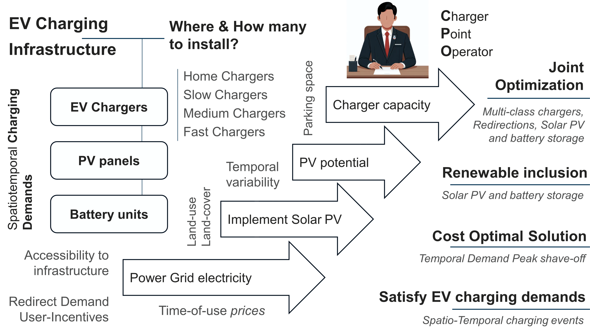
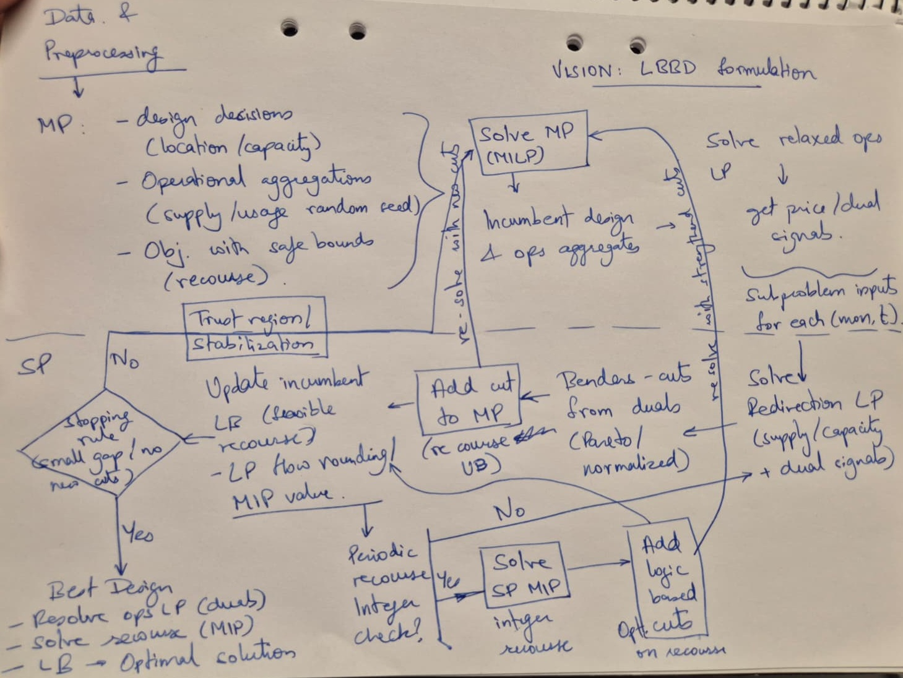
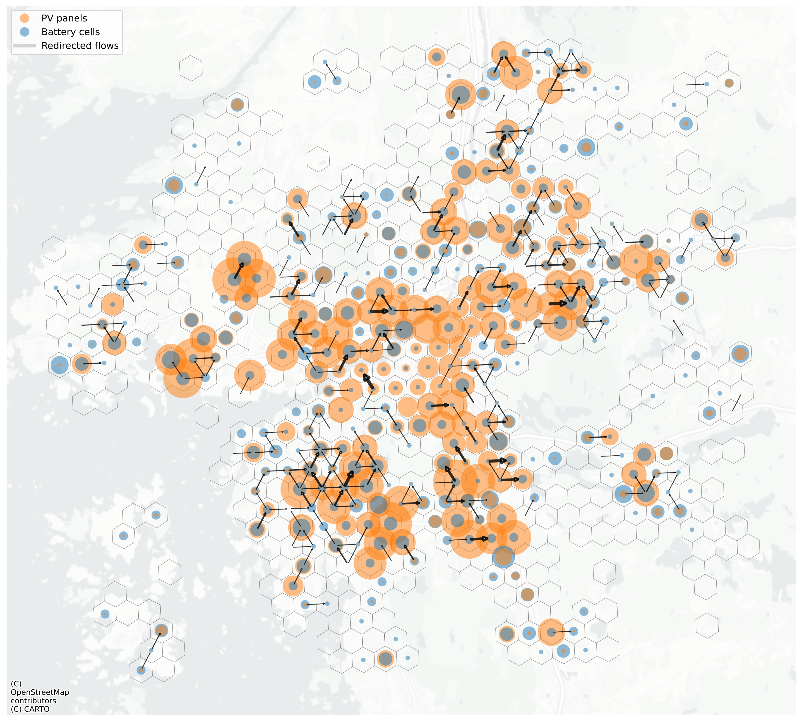

# Large-Scale Optimization
## PV- and BESS-enabled public EV charging with user redirection

This repository implements a large-scale mixed-integer linear optimization model for the joint planning of public EV charging infrastructure and distributed energy resources, namely photovoltaic (PV) generation and battery energy storage (BESS). It also includes incentive-based short-range spatial redirection of charging demand so that overloaded locations can be partially relieved through nearby available charging capacity.

The optimization is solved using a **Logic-Based Benders Decomposition (LBBD)**, which makes the problem tractable at city scale while preserving the key couplings between infrastructure investment, energy operation, and redirected charging demand.

The model is driven by spatiotemporal charging-demand data generated from the MATSim-based simulation framework [`UrbanEV-v2`](https://github.com/parishwadomkar/UrbanEV-v2), and is intended for large-scale urban charging infrastructure planning under realistic variation in charging demand, electricity tariffs, solar generation, and battery operation.

  

<em>Conceptual scope of the integrated charger–PV–BESS–redirection planning problem.</em>

---

## Conceptual scope

This repository addresses the planning problem from the perspective of a **Charging Point Operator (CPO)**. The goal is to determine how public charging infrastructure, PV panels, and battery storage should be deployed and operated so that annual net profit is maximized while aggregated charging demand is satisfied across space and time.

The framework combines long-term infrastructure investment with short-term operational scheduling in one model. It considers:

- multi-class public charger siting and sizing,
- co-located PV and battery deployment,
- tariff-aware battery charging and discharging,
- and incentive-based short-range spatial redirection of charging demand.

In this way, the model captures both the planning value of where assets are placed and the operational value of how energy and demand flexibility are used.

At a system level, the repository is meant to support the following question:

> How should a charging network operator jointly invest in chargers, PV, and battery storage, while selectively redirecting charging demand across nearby locations, in order to improve profitability and infrastructure utilization under time-varying demand and electricity prices?

The model is spatially aggregated over urban grid cells and temporally resolved using representative monthly days and half-hour intervals. It is therefore suitable for city-scale studies where the interaction between charging demand, local renewable generation, storage scheduling, and nearby demand redistribution must be represented explicitly, but where a direct monolithic solve becomes computationally burdensome.

This repository focuses on:

- joint charger, PV, and battery planning,
- operational scheduling under time-of-use electricity tariffs,
- incentive-based local demand redistribution,
- and scalable decomposition-based optimization for large problem instances.

The emphasis is on integrated urban-scale charging planning rather than detailed distribution-network power-flow physics.

---

## Solution approach

The main implementation of the decomposition-based solution is provided in [`LBBD_Small.ipynb`](./LBBD_Small.ipynb), which contains the master problem, slot-level subproblems, cut generation logic, and iterative bound updates used to solve the model.

  

<em>Conceptual LBBD workflow used to solve the large-scale charging planning problem.</em>

### Why decomposition is needed..

The original optimization problem is a large-scale MILP that jointly decides:

- where and how many public chargers to install,
- how many PV panels and battery units to deploy,
- how batteries should be charged and discharged over time,
- and how charging demand can be spatially redirected across nearby cells.

At city scale, this creates a strong coupling between long-term investment decisions and short-term operational decisions across many space-time combinations. A direct solve quickly becomes computationally expensive.

LBBD is therefore used to split the problem into a **master problem** and many **slot-level subproblems**, so that the planning structure is retained while the redirection logic is evaluated separately and iteratively.

### Why a logic-based Benders decomposition is used..

A classical Benders decomposition is effective when the recourse problem is cleanly linear. In this case, however, the redirection layer is not only a continuous transportation problem. It also includes:

- discrete trip logic,
- charger-type-specific receiving capacity,
- and operational coupling that must remain feasible when redirected demand is served.

For this reason, the repository uses a **Logic-Based Benders Decomposition** rather than a purely classical Benders scheme.

In practice:

- the **LP subproblem** is used to generate strong dual-based Benders cuts,
- the **MIP subproblem** is used to recover feasible discrete recourse values,
- and the master is tightened iteratively using both dual-based and logic-based cuts.

---
### Input data

The [`small/`](./small) folder contains sample input data for a smaller region in Gothenburg. These files support testing, reproducibility, and understanding of the model setup.

They represent the core spatial inputs required by the optimization, including:

- candidate grid cells and spatial boundaries,
- parking and charger-siting attributes,
- PV-related site information,
- and shortest-path distance data used for short-range user redirection.

---

## Results

The [`Results/`](./Results) folder contains exported solution outputs, figures, and summary files from the optimization runs.

The model is designed to quantify investment trade-offs and operational value under:

- public charger deployment decisions,
- PV and battery co-installation,
- time-of-use electricity prices,
- and short-range user redirection across nearby cells.

A representative result is shown below.

  

<em>Illustrative optimization output showing the interaction between PV, battery deployment, and user redirection.</em>

For the detailed numerical solution, check out [`Results_OptiSmall.xlsx`](./Results/Results_OptiSmall.xlsx). The file provides exported optimization outputs in spreadsheet form and can be used to inspect installed assets, operational values, and aggregated performance indicators in more detail.

---

## Contact / support

**Omkar Parishwad**  
Urban Mobility Research Group  
Chalmers University of Technology  
Email: [omkarp@chalmers.se](mailto:omkarp@chalmers.se)

For issues, feature requests, or reproducibility questions, please open a GitHub issue in this repository.

---

## Associated articles and data sources

### Charging infrastructure optimization

**Parishwad, Omkar; Najafi, Arsalan; Gao, Kun** — *Joint optimization of charging infrastructure and renewable energies with battery storage considering user redirection incentives.*  ([SSRN preprint](https://doi.org/10.2139/ssrn.5395539)).  

---
### Demand simulation source

The charging-demand inputs used in this optimization are based on the MATSim-driven simulation framework available at [UrbanEV-v2](https://github.com/parishwadomkar/UrbanEV-v2).

Published demand-modeling article:

**Parishwad, Omkar; Gao, Kun; Najafi, Arsalan** — *Integrated and Agent-Based Charging Demand Prediction Considering Cost-Aware and Adaptive Charging Behavior*. **Transportation Research Part D: Transport and Environment**, 154 (2026) 105285.  
  (DOI: https://doi.org/10.1016/j.trd.2026.105285)

---
